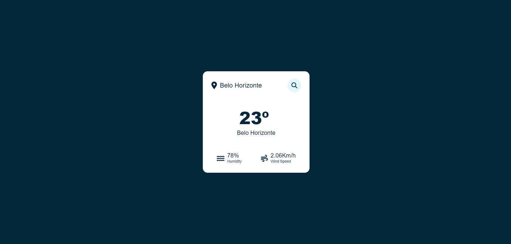

# Project Name: Weather-Search
---

## Description:
This project is a front-end application that utilizes the OpenWeather API to fetch weather data for cities around the world. Users can search for a city by name and view current weather conditions. The application features a clean and intuitive interface for easy navigation and data presentation.

## Features:
- **City Search:** Users can search for a city by name to view its current weather conditions.
- **Weather Data:** The application displays current weather information including temperature, humidity, wind speed, and weather description.
- **Responsive Design:** The application is designed to be responsive and work seamlessly across various devices and screen sizes.

## Technologies Used:
- **HTML:** Markup language for structuring the application.
- **CSS:** Styling language for designing the user interface.
- **JavaScript:** Programming language used to fetch data from the OpenWeather API and manipulate the DOM.
- **OpenWeather API:** API used to retrieve weather data for cities.
- **Font Awesome:** Icon library used for various weather icons.

## Installation:
1. Clone the repository to your local machine:
```git clone https://github.com/your_username/weather-app.git```
2. Navigate to the project directory:
```cd Weather-Search```
3. Open `index.html` in your preferred web browser.

## Usage:
1. Open the application in your web browser.
2. Enter the name of the city you want to search for in the provided input field.
3. Press the "Search" button or hit "Enter" to fetch weather data for the specified city.
4. View the current weather conditions displayed on the screen.

## Credits:
This project was inspired by existing weather application projects and utilizes various existing projects to create a functional and visually appealing user interface.

- **Font Awesome:** [https://fontawesome.com/](https://fontawesome.com/)
- **OpenWeather API:** [https://openweathermap.org/api](https://openweathermap.org/api)

## License:
This project is licensed under the [MIT License](LICENSE).

## Screenshots:



